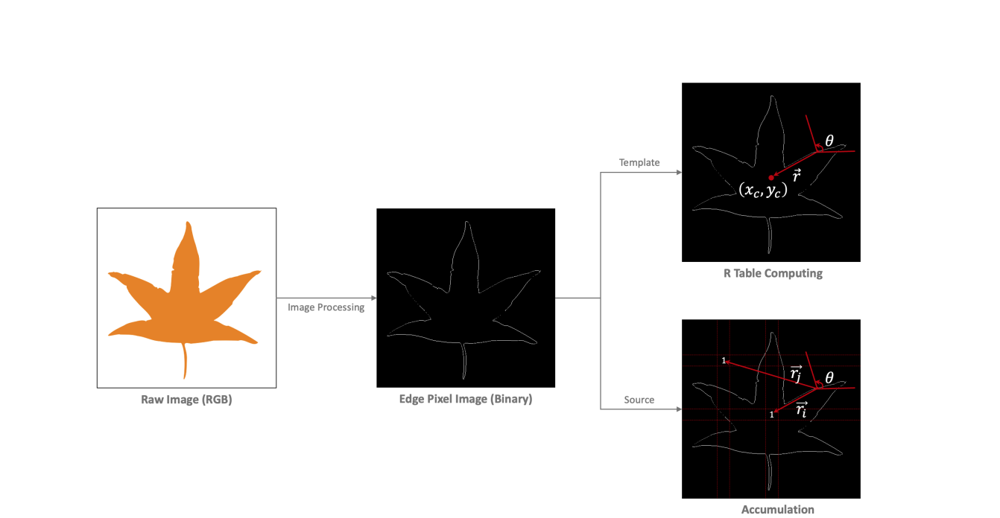

# Parallel Object Detector by Generalized Hough Transform

## 1. Summary

**Hough Transform** là một kỹ thuật bóc tách vật thể được sử dụng trong bài toán phân tích ảnh, thị giác máy tính, tiền xử lý ảnh kĩ thuật số. Mục đích của kỹ thuật này là tìm ra được các khoảng cách tương đối của vật thể trong một lớp hình dạng cụ thể thông qua thủ tục 'bỏ phiếu'. Nó được dùng cho việc xác định các định dạng có tham số chẳng hạn như những đường thẳng hay vòng tròn.

Còn **Generalized Hough Transform** có thể xác định vật thể có hình dạng bất kỳ, không thể biểu diễn bằng các phương trình hay tham số.

Trong đồ án này, chương trình được viết bằng ngôn ngữ Python 3 và được tối ưu hóa bằng thư viện Numba. Chương trình có thể chạy song song trên CPU và GPU.

## 2. Basic Knowledge

### 2.1 Hough transform

Ý tưởng xác định đường thẳng: Tạo mapping từ không gian ảnh (A) sang một không gian mới (B) sao cho mỗi đường thẳng trong không gian (A) sẽ ứng với một điểm trong không gian (B)

### 2.2 Generalized Hough Transform

Được phát triển từ thuật toán Hough Transform cơ bản. Khác với **Hough Transform** chỉ có thể phát hiện được các hình dạng đối tượng đơn giản như đường thẳng hay vòng tròn, Generalized Hough Transform có thể phát hiện được các hình dạng đối tượng phức tạp hơn như tam giác, hình bầu dục, hay hình nón.

## 3. Background

Các bước thực hiện thuật toán Generalized Hough Transform:

- Áp dụng derỉative filter (e.g Sobel Filter) cho cả 2 hình ảnh đầu vào (template và raw image) để xác định các edge pixels
- Encode tất cả các edge pixels của template thành bảng R-table
- Áp dụng thuật toán Gênralized Hough Transform vào ảnh raw, tính lũy tiến lượng 'phiếu bầu' của mỗi edge pixel vào ma trận lũy tiến 4D ($x$, $y$, $z$, $\theta$)
- Duyệt ma trận để tìm ra các điểm trung tâm của hình với lượng "phiếu bầu" cao nhất.

### 3.1 Image Processing

### 3.2 R-table computing ($\pi$-table)

### 3.3 Tính toán lũy tiến & Tìm ứng viên

### 3.4

## The Challenge

- Song song
- Phức tạp trong việc tìm điểm trung tâm của các hình dạng không có hình thù xác định.
