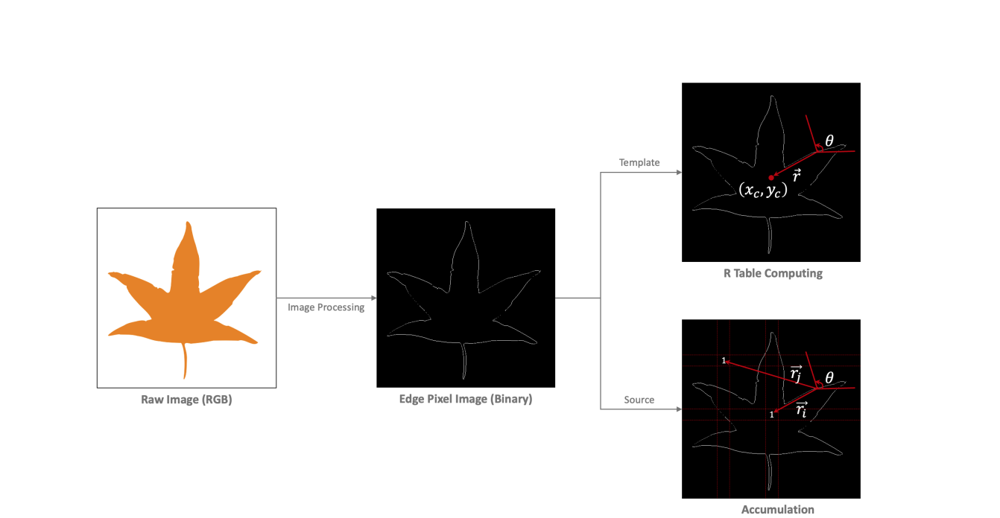

# Parallel Object Detector by Generalized Hough Transform

## 1. Summary

**Hough Transform** là một kỹ thuật bóc tách vật thể được sử dụng trong bài toán phân tích ảnh, thị giác máy tính, tiền xử lý ảnh kĩ thuật số. Mục đích của kỹ thuật này là tìm ra được các khoảng cách tương đối của vật thể trong một lớp hình dạng cụ thể thông qua thủ tục 'bỏ phiếu'. Nó được dùng cho việc xác định các định dạng có tham số chẳng hạn như những đường thẳng hay vòng tròn.

**Generalized Hough Transform** được phát triển để tìm kiếm các đối tượng phức tạp hơn. Thay vì tìm kiếm các đường thẳng, GHT có thể tìm kiếm bất kỳ hình dạng nào bằng cách tìm kiếm các điểm đặc trưng và tính toán các mẫu Hough tương ứng.

Trong đồ án này, chương trình được viết bằng ngôn ngữ Python 3 và được tối ưu hóa bằng thư viện Numba. Chương trình có thể chạy song song trên CPU và GPU.

## 2. Basic Knowledge

### 2.1 Hough Transform
1. Chọn đặc trưng của đối tượng cần tìm kiếm: Điều này có thể là các đường thẳng, các hình tròn, các đường cong hoặc bất kỳ hình dạng nào khác.

2. Tạo một không gian Hough: Đây là không gian nhiều chiều, trong đó mỗi chiều tương ứng với một tham số của đặc trưng đã chọn. Ví dụ, nếu đặc trưng của bạn là đường thẳng, thì không gian Hough có thể có hai chiều tương ứng với góc nghiêng và khoảng cách từ gốc tọa độ đến đường thẳng.

3. Thực hiện biến đổi Hough: Với mỗi điểm trên đặc trưng, tính toán tất cả các điểm trong không gian Hough tương ứng với các tham số của đặc trưng đó.

4. Tìm kiếm các điểm cao nhất trong không gian Hough: Điểm cao nhất trong không gian Hough tương ứng với tham số của đặc trưng tốt nhất. Ví dụ, trong trường hợp tìm kiếm đường thẳng, điểm cao nhất trong không gian Hough tương ứng với các tham số của đường thẳng tốt nhất.

5. Chuyển đổi các tham số tìm được thành hình dạng: Sau khi tìm được điểm cao nhất trong không gian Hough, bạn có thể chuyển đổi các tham số tương ứng thành hình dạng của đối tượng trong hình ảnh ban đầu.

6. Lọc các kết quả: Cuối cùng, bạn có thể áp dụng các bộ lọc để loại bỏ các kết quả không mong muốn hoặc giả mạo.

### 2.2 Generalized Hough Transform

1. Xác định đặc trưng của đối tượng cần tìm kiếm: Điều này có thể là bất kỳ hình dạng nào, bao gồm các đường thẳng, hình tròn, đường cong, hình tam giác, hình chữ nhật, v.v.

2. Tạo một "ma trận mẫu" (template matrix): Ma trận mẫu này chứa thông tin về đặc trưng của đối tượng trong không gian Hough. Để tạo ma trận mẫu, ta thực hiện các bước tương tự như trong HT, nhưng thay vì tính toán các điểm trong không gian Hough tương ứng với từng điểm trên đặc trưng, ta tính toán các mẫu Hough tương ứng với từng điểm trên đặc trưng.

3. Tính toán ma trận giá trị phi tại mỗi điểm trong hình ảnh: Ma trận giá trị phi chứa thông tin về sự tương đồng giữa mỗi vị trí trong hình ảnh và ma trận mẫu.

4. Tìm kiếm vị trí của đối tượng trong ma trận giá trị phi: Ta tìm vị trí trong ma trận giá trị phi có giá trị lớn nhất. Vị trí này tương ứng với vị trí của đối tượng trong hình ảnh.

5. Chuyển đổi vị trí tìm được thành hình dạng của đối tượng: Sau khi tìm được vị trí của đối tượng, ta chuyển đổi vị trí này thành hình dạng của đối tượng trong hình ảnh ban đầu.

6. Lọc kết quả: Cuối cùng, ta có thể áp dụng các bộ lọc để loại bỏ các kết quả không mong muốn hoặc giả mạo.

## 3. Background



### 3.1 Image Reading
Đọc ảnh đầu vào bằng thư viện OpenCV. Ở đây ta đọc ảnh Template(đối tượng cần tìm kiếm) và ảnh Source(ảnh chứa đối tượng cần tìm kiếm).

```python
```python

### 3.2 R-table computing ($\pi$-table)

### 3.3 Tính toán lũy tiến & Tìm ứng viên

### 3.4

## The Challenge

- Song song
- Phức tạp trong việc tìm điểm trung tâm của các hình dạng không có hình thù xác định.
