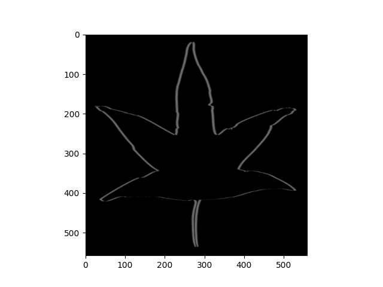

# Parallel Object Detector by Generalized Hough Transform

## 1. Summary

**Hough Transform** là một kỹ thuật bóc tách vật thể được sử dụng trong bài toán phân tích ảnh, thị giác máy tính, tiền xử lý ảnh kĩ thuật số. Mục đích của kỹ thuật này là tìm ra được các khoảng cách tương đối của vật thể trong một lớp hình dạng cụ thể thông qua thủ tục 'bỏ phiếu'. Nó được dùng cho việc xác định các định dạng có tham số chẳng hạn như những đường thẳng hay vòng tròn.

**Generalized Hough Transform** được phát triển để tìm kiếm các đối tượng phức tạp hơn. Thay vì tìm kiếm các đường thẳng, GHT có thể tìm kiếm bất kỳ hình dạng nào bằng cách tìm kiếm các điểm đặc trưng và tính toán các mẫu Hough tương ứng.

Trong đồ án này, chương trình được viết bằng ngôn ngữ Python 3 và được tối ưu hóa bằng thư viện Numba. Chương trình có thể chạy song song trên CPU và GPU.

## 2. Basic Knowledge

### 2.1 Hough Transform
1. Chọn đặc trưng của đối tượng cần tìm kiếm: Điều này có thể là các đường thẳng, các hình tròn, các đường cong hoặc bất kỳ hình dạng nào khác.

2. Tạo một không gian Hough: Đây là không gian nhiều chiều, trong đó mỗi chiều tương ứng với một tham số của đặc trưng đã chọn. Ví dụ, nếu đặc trưng của bạn là đường thẳng, thì không gian Hough có thể có hai chiều tương ứng với góc nghiêng và khoảng cách từ gốc tọa độ đến đường thẳng.

3. Thực hiện biến đổi Hough: Với mỗi điểm trên đặc trưng, tính toán tất cả các điểm trong không gian Hough tương ứng với các tham số của đặc trưng đó.

4. Tìm kiếm các điểm cao nhất trong không gian Hough: Điểm cao nhất trong không gian Hough tương ứng với tham số của đặc trưng tốt nhất. Ví dụ, trong trường hợp tìm kiếm đường thẳng, điểm cao nhất trong không gian Hough tương ứng với các tham số của đường thẳng tốt nhất.

5. Chuyển đổi các tham số tìm được thành hình dạng: Sau khi tìm được điểm cao nhất trong không gian Hough, bạn có thể chuyển đổi các tham số tương ứng thành hình dạng của đối tượng trong hình ảnh ban đầu.

6. Lọc các kết quả: Cuối cùng, bạn có thể áp dụng các bộ lọc để loại bỏ các kết quả không mong muốn hoặc giả mạo.

### 2.2 Generalized Hough Transform

1. Xác định đặc trưng của đối tượng cần tìm kiếm: Điều này có thể là bất kỳ hình dạng nào, bao gồm các đường thẳng, hình tròn, đường cong, hình tam giác, hình chữ nhật, v.v.

2. Tạo một "ma trận mẫu" (template matrix): Ma trận mẫu này chứa thông tin về đặc trưng của đối tượng trong không gian Hough. Để tạo ma trận mẫu, ta thực hiện các bước tương tự như trong HT, nhưng thay vì tính toán các điểm trong không gian Hough tương ứng với từng điểm trên đặc trưng, ta tính toán các mẫu Hough tương ứng với từng điểm trên đặc trưng.

3. Tính toán ma trận giá trị phi tại mỗi điểm trong hình ảnh: Ma trận giá trị phi chứa thông tin về sự tương đồng giữa mỗi vị trí trong hình ảnh và ma trận mẫu.

4. Tìm kiếm vị trí của đối tượng trong ma trận giá trị phi: Ta tìm vị trí trong ma trận giá trị phi có giá trị lớn nhất. Vị trí này tương ứng với vị trí của đối tượng trong hình ảnh.

5. Chuyển đổi vị trí tìm được thành hình dạng của đối tượng: Sau khi tìm được vị trí của đối tượng, ta chuyển đổi vị trí này thành hình dạng của đối tượng trong hình ảnh ban đầu.

6. Lọc kết quả: Cuối cùng, ta có thể áp dụng các bộ lọc để loại bỏ các kết quả không mong muốn hoặc giả mạo.

## 3. Background


### 3.1 Process Template
#### 3.1.1 Image Reading
Đọc ảnh đầu vào bằng thư viện OpenCV. Ở đây ta đọc ảnh Template(đối tượng cần tìm kiếm) và ảnh Source(ảnh chứa đối tượng cần tìm kiếm).


#### 3.1.2. Gray Scale
Bước này ta sẽ dùng công thức GrayScale để chuyển một pixel 3 chiều (RGB) sang một pixel 1 chiều (GrayScale). Công thức GrayScale được tính như sau:
```
GrayScale = 0.299 * R + 0.587 * G + 0.114 * B
```
Trong đó R, G, B lần lượt là giá trị của 3 kênh màu Red, Green, Blue.


#### 3.1.3 Edge Detector
Áp dụng bộ lọc Sobel để phát hiện cạnh của mẫu. Bộ lọc Sobel được áp dụng theo hai hướng: ngang và dọc.

Ở đây ta sẽ tích chập mỗi pixel của ảnh với ma trận Sobel. Với mỗi filter có công thức như sau:
```
SobelX = [[-1, 0, 1], [-2, 0, 2], [-1, 0, 1]]
SobelY = [[-1, -2, -1], [0, 0, 0], [1, 2, 1]]
```
Sau khi tích chập ta sẽ được 2 ma trận mới là `Gx` và `Gy`.


#### 3.1.4 Magnitude and Orientation
Ta sẽ tính toán độ lớn và hướng của cạnh của mẫu bằng cách sử dụng hàm `magnitude` và `orientation` với kết quả từ bước 2.

Với `magnitude` ta sẽ tính độ lớn của cạnh bằng cách sử dụng công thức sau:
```python
magnitude = sqrt(Gx^2 + Gy^2)
```
Với `orientation` ta sẽ tính hướng của cạnh bằng cách sử dụng công thức sau:
```python
orientation = arctan(Gy / Gx)
```



#### 3.1.5 Edge Minmax
Áp dụng kỹ thuật edge minmax (edgemns) để tìm các điểm cạnh tối đa trong mẫu.
Cụ thể, ta sẽ slice góc của cạnh thành các góc $\pi$/4 và so sánh với các neighbour của nó tùy thuộc với từng góc. Nếu nó là cực đại trong các neighbour của nó thì nó sẽ được giữ lại, ngược lại nó sẽ bị loại bỏ.

Với slice góc $\pi$/4 ta sẽ có 4 trường hợp:
- Góc 0: ta sẽ so sánh với các điểm ở bên trái và bên phải của nó.
- Góc $\pi$/4: ta sẽ so sánh với các điểm ở bên trái trên và bên phải dưới của nó.
- Góc $\pi$/2: ta sẽ so sánh với các điểm ở bên trên và bên dưới của nó.
- Góc $3\pi$/4: ta sẽ so sánh với các điểm ở bên trái dưới và bên phải trên của nó.


#### 3.1.6 Threshold
Từ kết quả của edge minmax ta sẽ áp dụng ngưỡng (threshold) để tạo ra một bức ảnh nhị phân từ các điểm cạnh tối đa đã tìm được.
Nếu một điểm có giá trị lớn hơn ngưỡng thì nó sẽ được gán giá trị 255, ngược lại nó sẽ được gán giá trị 0.

Việc này dùng để cho mẫu ảnh sẽ bớt nhiễu và tập trung vào các điểm cạnh tối đa.


#### 3.1.7 R-table computing ($\phi$-table)
Tạo bảng R (R-table) bằng cách kết quả từ bước 3 và 5. Bảng R sẽ được sử dụng trong quá trình tìm kiếm đối tượng trong ảnh.

Cách tạo bảng R như sau:
1. Lấy các chỉ số của các điểm ảnh có giá trị bằng 255 trong mẫu độ xám đã được xử lý ở bước trước đó (bước số 6 trong đoạn code trên). Các điểm ảnh này được coi là các điểm cạnh trong mẫu.
2. Tính toán góc của mỗi điểm cạnh bằng cách lấy phần dư của hướng cạnh tại điểm cạnh đó với 360 độ. Kết quả được lưu vào biến $\phi$.
3. Tính toán chỉ số của bin R (khối R) mà mỗi điểm cạnh sẽ được lưu trữ trong bảng R. Chỉ số này được tính bằng cách chia góc phi cho `DELTA_ROTATION_ANGLE` và lấy phần nguyên của kết quả. `DELTA_ROTATION_ANGLE` là một hằng số được sử dụng để chia các góc thành các bin R khác nhau.
4. Tính toán khoảng cách từ mỗi điểm cạnh tới trung tâm của mẫu. Kết quả được lưu vào biến $r$.
5. Tính toán góc alpha mà mỗi điểm cạnh tạo với trục tọa độ x. Kết quả được lưu vào biến alpha. 
6. Với mỗi điểm cạnh, tạo một mục mới trong bảng R chứa các giá trị r và alpha tương ứng. Mục này sẽ được lưu trữ trong bin R được xác định ở bước 3. Các mục này được lưu trữ trong một danh sách các mục trong bảng R, được đại diện bằng một mảng 2D, với các hàng tương ứng với các bin R khác nhau.


### 3.2 Accumulate Source 
Ở bước này ta sẽ lặp lại các bước xử lí ảnh như phần Template. Và sử dụng dữ liệu từ R-table để tìm kiếm đối tượng trong ảnh.
Điểm khác biệt ở phần này chính là phần tích lũy (accumualte) các điểm cạnh tìm được trong ảnh. Với mỗi điểm cạnh ta sẽ có được orientation của điểm cạnh. Dựa vào R-table, ta sẽ tính được điểm center của đối tượng trong ảnh. Từ đó ta sẽ tính lũy thông số center của đối tượng trong ảnh.

Việc tính tọa độ center của đối tượng trong ảnh được tính bởi công thưc sau:
```python
x = x0 + r * cos(alpha + phi)
y = y0 + r * sin(alpha + phi)
```
Trong đó:
- `x0` và `y0` là tọa độ của điểm cạnh trong ảnh.
- `r` là khoảng cách từ điểm cạnh tới trung tâm của mẫu.
- `alpha` là góc mà điểm cạnh tạo với trục tọa độ x.
- `phi` là góc của điểm cạnh trong mẫu.

Sau khi tích lũy xong, ta sẽ có một ma trận tích lũy, từ đó có được các cực đại địa phương (local maxima) của ma trận tích lũy. Các cực đại địa phương này chính là các điểm center của đối tượng trong ảnh.


## Install and Run
Để cài dặt và chạy chương trình. Trước tiên cần chạy file `setup.py` để cài đặt các thư viện cần thiết cho chương trình.
```bash
git clone git@github.com:lavData/ltss_seminar.git
cd ltss_seminar
pip install -e .
```
Để chạy chương trình ta chạy dòng code này ở một file python hay notebook.

```python
import cv2
from src.seq import SeqGeneralHoughTransform
template = cv2.imread('images/template.png', 0)
src = cv2.imread('images/source.png', 0)
seq = SeqGeneralHoughTransform(template, src)
```


## The Challenge

- Mục tiêu song song hóa nhóm chưa thực hiện được. Cần speed run ở 2 tuần tiếp theo. 
- Nhóm có mục tiêu tăng chiều của bài toán, hiện tại bài toán chỉ có 2 chiều (height, width), nhưng muốn tăng lên 4 chiều (height, width, depth, rotation) thì sẽ gặp khó khăn về thời gian tính toán.

## References
- [Generalized Hough Transform](https://en.wikipedia.org/wiki/Generalised_Hough_transform)
- [Lines Detection with Hough Transform](https://towardsdatascience.com/lines-detection-with-hough-transform-84020b3b1549#:~:text=The%20Hough%20Transform%20is%20an,and%20quadrilaterals%20of%20specific%20types.)
- [Parallel Object Detector with Generalized Hough Transform](https://github.com/YijieChen720/Parallel-Object-Detector-with-Generalized-Hough-Transform/blob/main/README.md)
- [Sobel Filter](https://homepages.inf.ed.ac.uk/rbf/HIPR2/sobel.htm)
